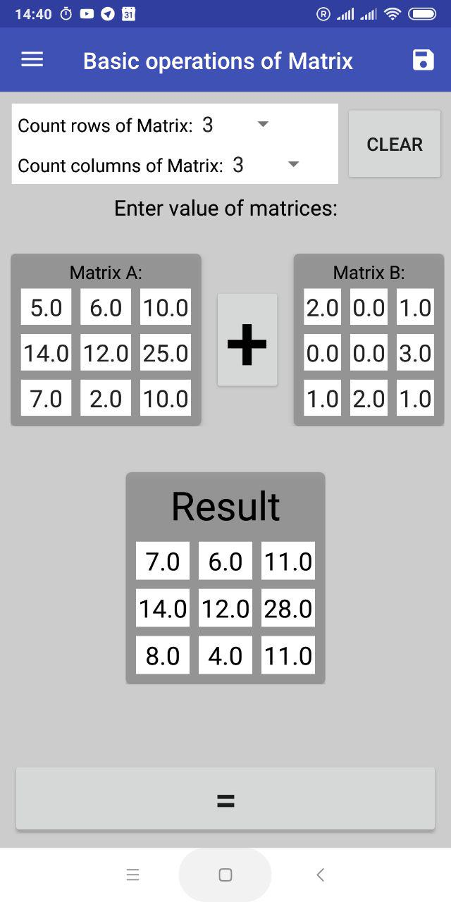
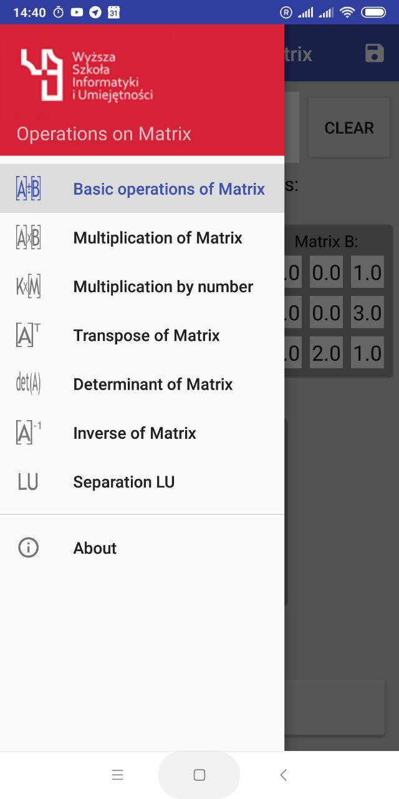
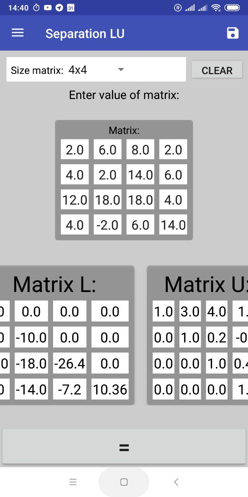
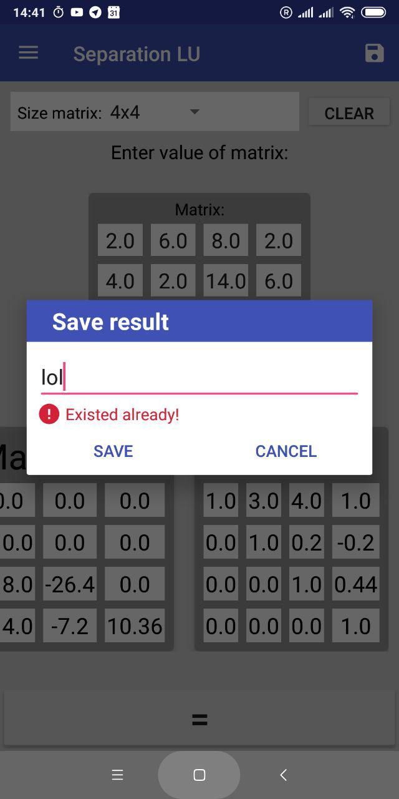
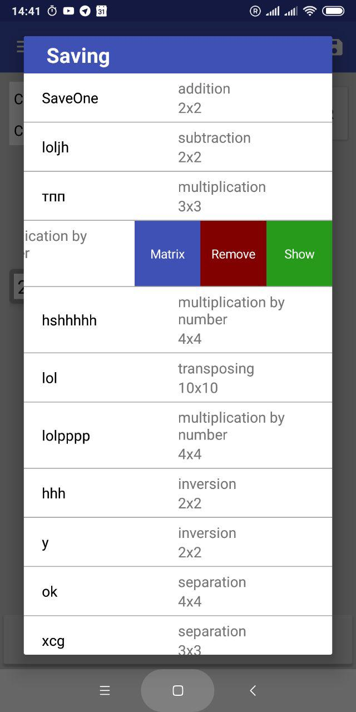
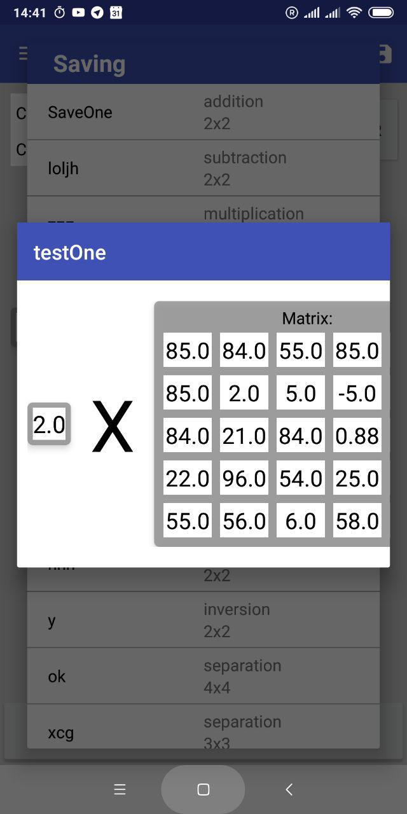
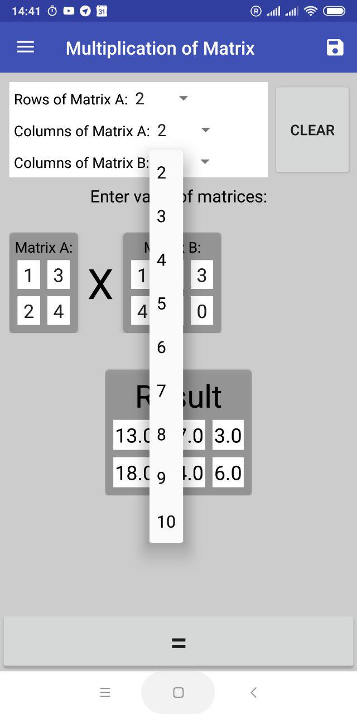

# AndroidMatrixCanculator
This app does difference operation on Matrix:
* Addition 
* Subtraction
* Multiplication
* Transpose
* Determinant
* Inversion

## I dedicated this program to a wonderful teacher Krzysztof Dems(Teacher of higher mathematics)

&nbsp;
&nbsp;
&nbsp;
&nbsp;
&nbsp;
&nbsp;
&nbsp;

## <a href="https://github.com/AlieksieievYurii/AndroidMatrixCanculator/tree/master/ApkFIle">Apk file</a>

I'm changing the document to create a commit to trigger the pipeline on Azure DevOps.
Change one more time.

